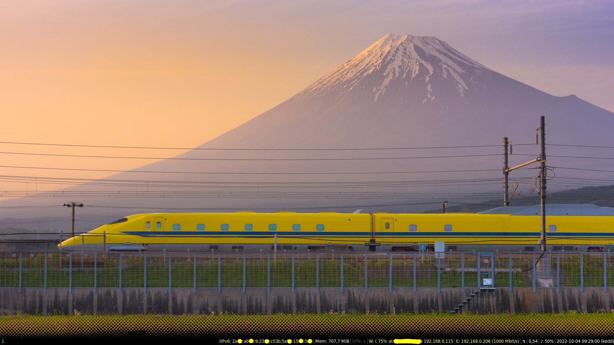

# halfdot-conky
A black conky bar to create a gradient transition between the panel and wallpaper

I think it is mostly ideal for nature wallpapers. The attached config is for i3wm.
If your bar has a different color, you will have to recolor the image.
Also if your screen is wider than 1920px, you will need to extend the image.

